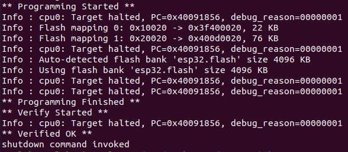

# ESP32-With-ESP-PROG-Demo
Debug your embedded software with ESP32, ESP-PROG, and JTAG. This project is part of a course at University of Massachusetts Lowell, and some details may need to be changed to work for other readers.

## Overview

The ESP32 supports the JTAG debugging interface, which can allow users to debug their embedded applications much like they would a normal Windows/Linux executable. For instance, JTAG allows users to place breakpoints in code, view the memory stack, view registers, and more. However, most ESP32 boards on the market do not contain the required hardware for communicating with an external JTAG adapter. This hardware can be found on chips such as FT2232HL, which is implemented by the ESP-PROG. Other technical details will be spared here. You may refer to Espressif's guides on [JTAG debugging](https://docs.espressif.com/projects/esp-idf/en/latest/esp32/api-guides/jtag-debugging/index.html) and [ESP-PROG](https://docs.espressif.com/projects/espressif-esp-iot-solution/en/latest/hw-reference/ESP-Prog_guide.html) for more information on these topics.

See below for a look at how our custom ESP32 board may connect to ESP-PROG:


The purpose of this project is to show users how to pair the ESP32 development board with the ESP-PROG device. As a demonstration, this repository contains the **hello_world** sample project. We will perform some simple debugging tasks on this project as a demonstration.

## Hardware Setup

You will need the following hardware to complete this project:

* An ESP32-WROOM-32 development board, such as our custom board
* ESP-PROG
* 1 USB cable
* At least 6 female-to-female jumper wires

ESP-PROG contains a 10-pin header which allows wiring to the JTAG interface. For reference, each pin on the header is numbered in the figure below: 


To wire the ESP32 to the ESP-PROG, use the table below as a guide. Note that four of the pins on the headers will go unused.

| **ESP-PROG pin** | **ESP32 pin** |
| - | - |
| 1 (VDD) | 5V |
| 2 (TMS) | 14 |
| 3 (GND) | GND |
| 4 (TCK) | 13 |
| 5 (GND) | - |
| 6 (TDO) | 15 |
| 7 (GND) | - |
| 8 (TDI) | 12 |
| 9 (GND) | - |
| 10 (NC) | - |

To connect the devices to your host computer, you can connect the ESP-PROG to the computer directly via a USB cable. See the following image for a demonstration:

 

You do not need to connect the ESP32 to your computer directly. It will receive power from the ESP-PROG via the VDD pin. The JTAG interface also enables programming capabilities for uploading the application to the ESP32, so there is no need to connect to the UART controller on the development board.

## Software Setup

Make sure you have ESP-IDF installed on your computer. Download this repository with the following command:

```
git clone https://github.com/PBearson/ESP32-With-ESP-PROG-Demo.git
```

After connecting your devices to the computer, make sure your Operating System can the USB controller (FTDI). In VirtualBox, you should attach the following USB controller to your virtual machine:

* **Devices -> USB -> FTDI Dual RS232-HS**

Now it is time to get the application ready so we can debug it. Navigate to the _hello_world_ directory. Run the following command to build the app:

```
idf.py build
```

Now use JTAG to upload the app to the board. To do this, we will use OpenOCD, a software that can communicate with ESP-PROG (and many other adapters) to access the JTAG interface. Run the following command to program the ESP32:

```
openocd -f board/esp32-wrover-kit-3.3v.cfg -c "program_esp build/hello-world.bin 0x10000 verify exit"
```

If the command succeeds, you will see output showing the binary was uploaded to the board and verified. See below for reference:



## Testing JTAG


```
idf.py openocd gdb
```

If the above command does not launch the GDB session, you may need to press the **EN** button on your development board first, and then try the command again.

TODO run openocd and different commands (place breakpoints, read stack frame, read registers)
