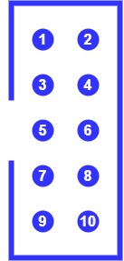

# ESP32-With-ESP-PROG-Demo
Debug your embedded software with ESP32, ESP-PROG, and JTAG. This project is part of a course at University of Massachusetts Lowell, and some details may need to be changed to work for other readers.

## Overview

The ESP32 supports the JTAG debugging interface, which can allow users to debug their embedded applications much like they would a normal Windows/Linux executable. For instance, JTAG allows users to place breakpoints in code, view the memory stack, view registers, and more. However, most ESP32 boards on the market do not contain the required hardware for communicating with an external JTAG adapter. This hardware can be found on chips such as FT2232HL, which is implemented by the ESP-PROG. Other technical details will be spared here. You may refer to Espressif's guides on [JTAG debugging](https://docs.espressif.com/projects/esp-idf/en/latest/esp32/api-guides/jtag-debugging/index.html) and [ESP-PROG](https://docs.espressif.com/projects/espressif-esp-iot-solution/en/latest/hw-reference/ESP-Prog_guide.html) for more information on these topics.

See below for a look at how our custom ESP32 board may connect to ESP-PROG:

The purpose of this project is to show users how to pair the ESP32 development board with the ESP-PROG device. As a demonstration, this repository contains the **Provision-ECC608** sample project which generates a key pair and CSR on the ATECC608A crypto chip, which is included on our development board. We will perform some simple debugging tasks on this project as a demonstration.

## Hardware Setup

| **ESP-PROG pin** | **ESP32 pin** |
| - | - |
| 1 (VDD) | - |
| 2 (TMS) | 14 |
| 3 (GND) | GND |
| 4 (TCK) | 13 |
| 5 (GND) | - |
| 6 (TDO) | 15 |
| 7 (GND) | - |
| 8 (TDI) | 12 |
| 9 (GND) | - |
| 10 (NC) | - |

Wiring, hardware, etc.

## Software Setup

TODO ESP-IDF, project example, etc.

## Testing JTAG

TODO run openocd and different commands (place breakpoints, read stack frame, read registers)
