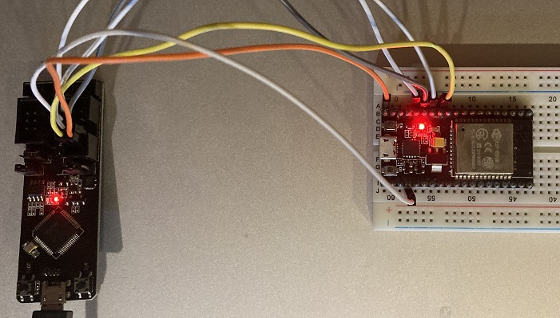
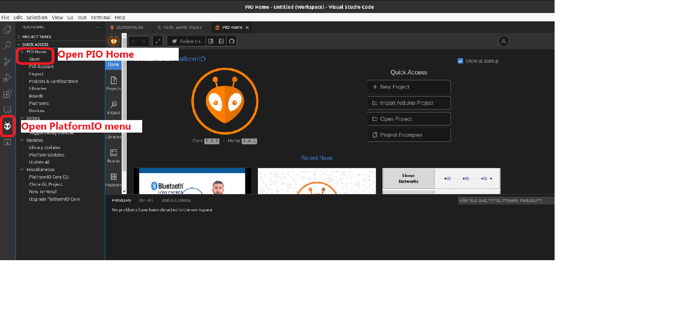

# ESP32-With-ESP-PROG-Demo
Debug your embedded software with ESP32, ESP-PROG, and JTAG. This project is part of a course at University of Massachusetts Lowell, and some details may need to be changed to work for other readers.

## Overview

The ESP32 supports the JTAG debugging interface, which can allow users to debug their embedded applications much like they would a normal Windows/Linux executable. For instance, JTAG allows users to place breakpoints in code, view the memory stack, view registers, and more. However, most ESP32 boards on the market do not contain the required hardware for communicating with an external JTAG adapter. This hardware can be found on chips such as FT2232HL, which is implemented by the ESP-PROG. Other technical details will be spared here. You may refer to Espressif's guides on [JTAG debugging](https://docs.espressif.com/projects/esp-idf/en/latest/esp32/api-guides/jtag-debugging/index.html) and [ESP-PROG](https://docs.espressif.com/projects/espressif-esp-iot-solution/en/latest/hw-reference/ESP-Prog_guide.html) for more information on these topics.

See below for a look at how the Hiletgo ESP-WROOM-32 board may connect to ESP-PROG:



The purpose of this project is to show users how to pair the ESP-WROOM-32 development board with the ESP-PROG device. We will use Visual Studio Code and PlatformIO, which is a software plugin that enables app development on numerous IoT microcontrollers such as ESP32. Using VSCode and PlatformIO, we will import an example ESP32 project into our workspace, compile it, upload it, and perform some debugging all through the ESP-PROG debugger debugging board.

## Prerequisites

Download the Ubuntu VM, which already has VSCode and PlatformIO installed: https://www.dropbox.com/s/0g7w8qduzj2rb1k/UbuntuIoT.ova?dl=0

Import the VM into VirtualBox and launch it. The default username is `iot`. The password is `toi`.

The debugging software has a dependency on libpython2.7.so.1.0, so we need to install it. Open a terminal and run the following commands:

```
sudo apt update
sudo apt install libpython2.7
```

## Hardware Setup

You will need the following hardware to complete this project:

* A Hiletgo ESP32-WROOM-32 development board
* ESP-PROG
* 1 USB cable
* 6 male-to-female jumper wires

ESP-PROG contains a 10-pin header which allows wiring to the JTAG interface. For reference, each pin on the header is numbered in the figure below: 


To wire the ESP32 to the ESP-PROG, use the table below as a guide. Note that four of the pins on the headers will go unused.

| **ESP-PROG pin** | **ESP32 pin** |
| - | - |
| 1 (VDD) | 5V |
| 2 (TMS) | 14 |
| 3 (GND) | GND |
| 4 (TCK) | 13 |
| 5 (GND) | - |
| 6 (TDO) | 15 |
| 7 (GND) | - |
| 8 (TDI) | 12 |
| 9 (GND) | - |
| 10 (NC) | - |

To connect the devices to your host computer, you can connect the ESP-PROG to the computer directly via a USB cable. You do **not** need to connect the ESP32 to your computer directly. It will receive power from the ESP-PROG via the VDD pin. The JTAG interface also enables programming capabilities for uploading the application to the ESP32, so there is no need to connect to the UART controller on the development board.

## Software Setup

After connecting the ESP-PROG to the computer, make sure your Operating System can see the USB controller (FTDI). In VirtualBox, you should attach the following USB controller to your virtual machine:

* **Devices -> USB -> FTDI Dual RS232-HS**

Open VSCode. We are going to import an example "hello world" project into our workspace. Click on the PlatformIO icon on the left side of the screen. In the `Quick Access` menu, click on `PIO Home -> Open` to open the PIO Home page. The screenshot below shows how to do this:



Click on `Project Examples`, and type `espidf-hello-world`. Select it, then hit `import`. This will install the project into your workspace. 

By default, the file `platformio.ini` should open, but if not, you can easily open it by clicking the Explorer icon on the left side of the screen, which will show all files in this project.

TODO discuss platformio.ini

```
[env:esp-prog]
board = esp32dev
debug_tool = esp-prog
upload_protocol = esp-prog
debug_init_break = tbreak app_main
```

## Testing JTAG

TODO

### Upload Firmware

TODO use the standard upload task with esp-prog interface enabled.

### Launch Debugger

TODO launch debugger, skip pre-debugging tasks

### Debug

TODO set breakpoint in printf function and continue into that function: `thb` and `c`
TODO advance to the next instruction a few times: `ni`
Notice how the registers change, including PC.

### Change Registers

TODO change the instruction pointer to the beginning of printf: `set $pc=printf`
Print out the instruction pointer

## Change Memory

TODO restart the debugging session. Place a breakpoint in the while loop in app_main at the print statement, line 34). Go to the breakpoint.
Change the variable `i` in the Variables -> Local sub-menu. Double click on the variable, and edit it to ant value you want, such as 100.
Then go back to the debug console 

### Download Firmware

TODO open terminal and find firmware: `find -name firmware.elf`
TODO list memory mappings of different sections in firmware: `readelf -S <path to firmware.bin>`

TODO launch debugger and use memory dump instructions to dump firmware at run-time.
