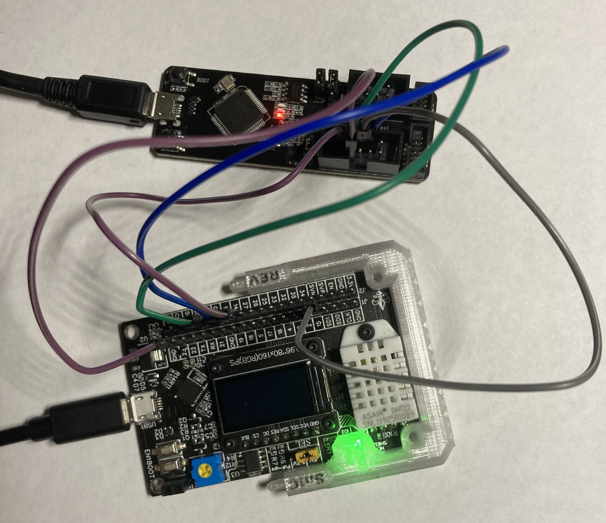

# ESP32-With-ESP-PROG-Demo
Debug your embedded software with ESP32, ESP-PROG, and JTAG.

## Overview

The ESP32 supports the JTAG debugging interface, which can allow users to debug their embedded applications much like they would a normal Windows/Linux executable. For instance, JTAG allows users to place breakpoints in code, view the memory stack, view registers, and more. However, most ESP32 boards on the market do not contain the required hardware for communicating with an external JTAG adapter. This hardware can be found on chips such as FT2232HL, which is implemented by the ESP-PROG. Other technical details will be spared here. You may refer to Espressif's guides on [JTAG debugging](https://docs.espressif.com/projects/esp-idf/en/latest/esp32/api-guides/jtag-debugging/index.html) and [ESP-PROG](https://docs.espressif.com/projects/espressif-esp-iot-solution/en/latest/hw-reference/ESP-Prog_guide.html) for more information on these topics.  

TODO Show picture of setup, describe how it works

## Hardware Setup

Wiring, hardware, etc.

## Software Setup

TODO ESP-IDF, project example, etc.

## Testing JTAG

TODO run openocd and different commands (place breakpoints, read stack frame, read registers)
