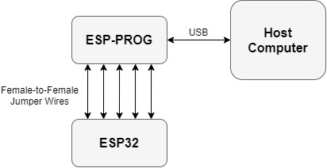
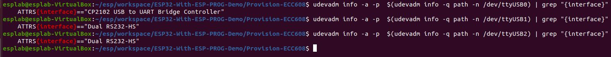

# ESP32-With-ESP-PROG-Demo
Debug your embedded software with ESP32, ESP-PROG, and JTAG. This project is part of a course at University of Massachusetts Lowell, and some details may need to be changed to work for other readers.

## Overview

The ESP32 supports the JTAG debugging interface, which can allow users to debug their embedded applications much like they would a normal Windows/Linux executable. For instance, JTAG allows users to place breakpoints in code, view the memory stack, view registers, and more. However, most ESP32 boards on the market do not contain the required hardware for communicating with an external JTAG adapter. This hardware can be found on chips such as FT2232HL, which is implemented by the ESP-PROG. Other technical details will be spared here. You may refer to Espressif's guides on [JTAG debugging](https://docs.espressif.com/projects/esp-idf/en/latest/esp32/api-guides/jtag-debugging/index.html) and [ESP-PROG](https://docs.espressif.com/projects/espressif-esp-iot-solution/en/latest/hw-reference/ESP-Prog_guide.html) for more information on these topics.

See below for a look at how our custom ESP32 board may connect to ESP-PROG:


The purpose of this project is to show users how to pair the ESP32 development board with the ESP-PROG device. As a demonstration, this repository contains the **esp32-ecc608-dht22-st7735** sample project which showcases the capabilities of the sensors on our development board. We will perform some simple debugging tasks on this project as a demonstration.

## Hardware Setup

You will need the following hardware to complete this project:

* An ESP32-WROOM-32 development board, such as our custom board
* ESP-PROG
* 2 USB cables
* At least 5 female-to-female jumper wires
* Optionally, a USB hub with at least 2 ports

ESP-PROG contains a 10-pin header which allows wiring to the JTAG interface. For reference, each pin on the header is numbered in the figure below: 


To wire the ESP32 to the ESP-PROG, use the table below as a guide. Note that five of the pins on the headers will go unused.

| **ESP-PROG pin** | **ESP32 pin** |
| - | - |
| 1 (VDD) | - |
| 2 (TMS) | 14 |
| 3 (GND) | GND |
| 4 (TCK) | 13 |
| 5 (GND) | - |
| 6 (TDO) | 15 |
| 7 (GND) | - |
| 8 (TDI) | 12 |
| 9 (GND) | - |
| 10 (NC) | - |

To connect the devices to your host computer, you can connect the devices to a USB hub and connect the hub to the computer. See the following image for a demonstration:

 

If you have multiple open ports on your computer, you do not need the USB hub. Furthermore, the ESP-PROG contains a UART header which can be used to communicate with the ESP32 over UART without the need for a second USB cable.

## Software Setup

Make sure you have ESP-IDF installed on your computer. Download this repository with the following command:

```
git clone --recursive https://github.com/PBearson/ESP32-With-ESP-PROG-Demo.git
```

After connecting your devices to the computer, make sure your Operating System can see them. In VirtualBox, you should attach the USB controllers to your virtual machine:

* UART: Enable **Devices -> USB -> Silicon Labs CP2102 USB to UART Bridge Controller**
* JTAG: Enable **Devices -> USB -> FTDI Dual RS232-HS**

ESP-PROG's controller (FTDI Dual) contains 2 separate USB interfaces, while the ESP32's controller (CP2102) has a single interface; this means that 3 USB devices will become accessible when you attach both controllers. Most likely, these will show up under **/dev/ttyUSB\***. To find all attached USB devices, run the following command:

```
find /dev/ -name ttyUSB*
```

It is helpful to know which USB device belongs to which interface. To see the interface of a given device, run the following command:

```
udevadm info -a -p  $(udevadm info -q path -n <device>) | grep "{interface}"
```

Replace _\<device\>_ with _/dev/ttyUSB0_, _/dev/ttyUSB1_, etc. A demonstration of this can be seen below:



TODO ESP-IDF, project example, etc.

## Testing JTAG

TODO run openocd and different commands (place breakpoints, read stack frame, read registers)
