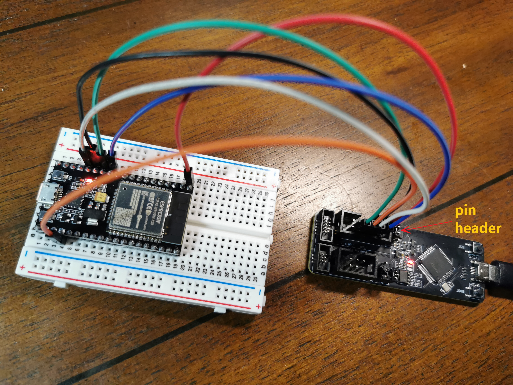
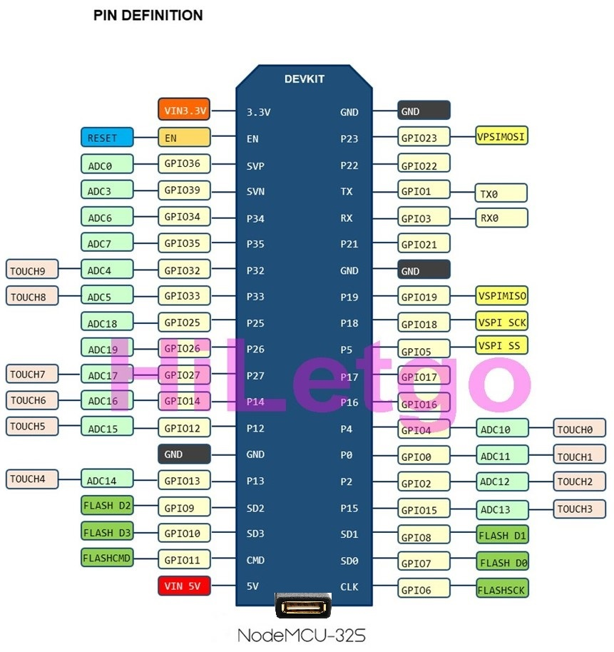
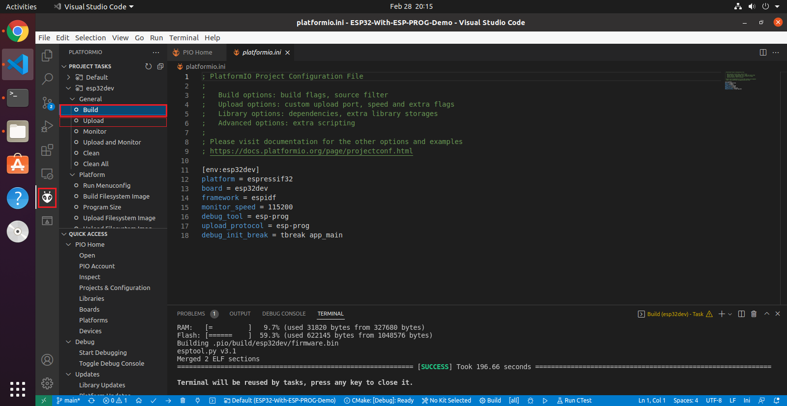
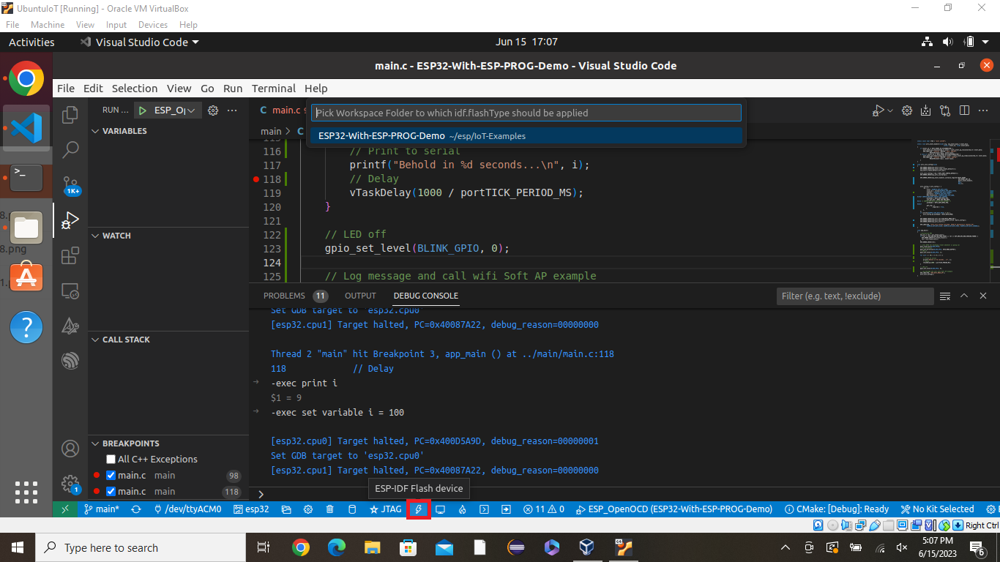
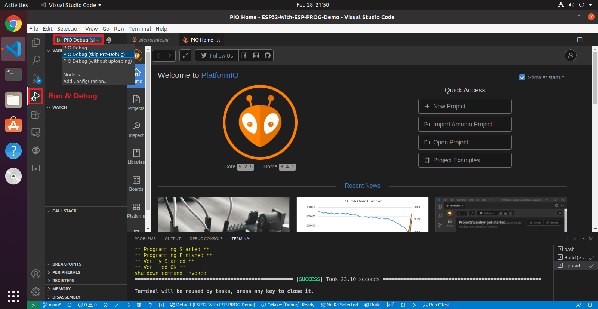
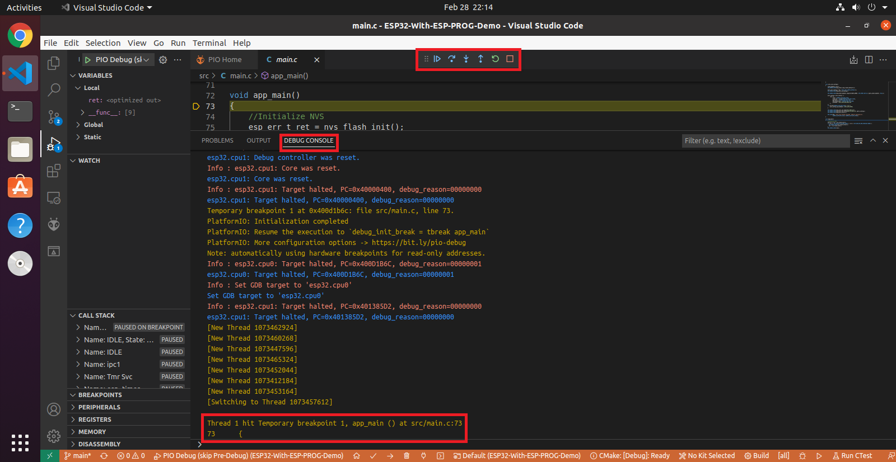
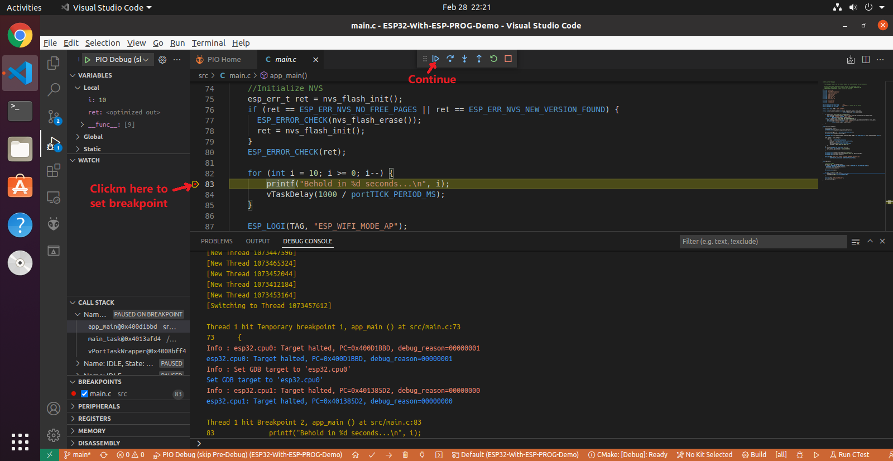
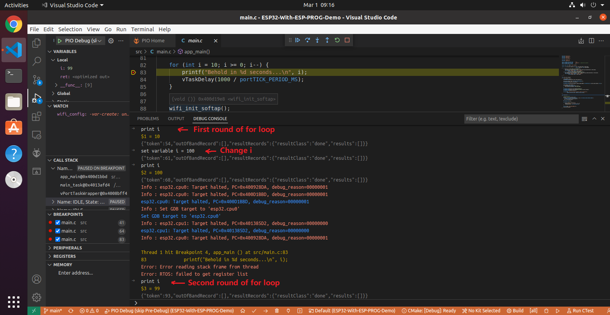
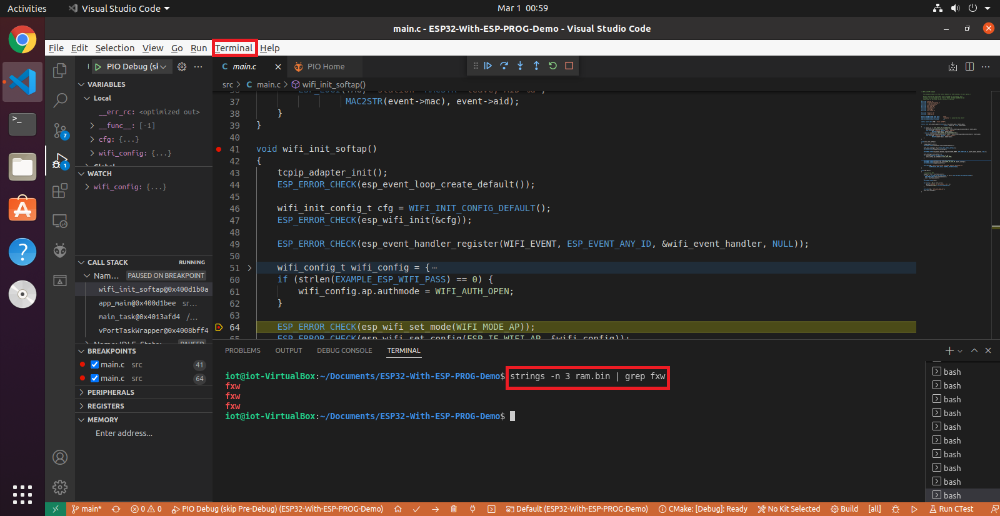

# Debugging ESP32 App with ESP-PROG 
Debug your embedded software with ESP32, ESP-PROG, and JTAG. This project is part of a course at University of Massachusetts Lowell, and some details may need to be changed to work for other readers.

The ESP32 app in this project sets up the ESP32 board as a WiFi access point with SSID of *fxw* and password of *xinwenfu*.

<!---
## Table of Contents

1. [Overview](https://github.com/PBearson/ESP32-With-ESP-PROG-Demo#overview)
2. [Prerequisites](https://github.com/PBearson/ESP32-With-ESP-PROG-Demo#prerequisites)
3. [Hardware Setup](https://github.com/PBearson/ESP32-With-ESP-PROG-Demo#hardware-setup)
4. [Software Setup](https://github.com/PBearson/ESP32-With-ESP-PROG-Demo#software-setup)
5. [Debugging](https://github.com/PBearson/ESP32-With-ESP-PROG-Demo#debugging)
6. [Disable JTAG](https://github.com/PBearson/ESP32-With-ESP-PROG-Demo#disable-jtag)
7. [Use JTAG Without the Firmware](https://github.com/PBearson/ESP32-With-ESP-PROG-Demo#use-jtag-without-the-firmware)
8. [Notes](https://github.com/PBearson/ESP32-With-ESP-PROG-Demo#notes)
--->

## Overview

The ESP32 supports the JTAG debugging interface, which can allow users to debug their embedded applications through **GDB** much like they would debug a normal Windows/Linux executable. For instance, JTAG allows users to place breakpoints in code, view the memory stack, view registers, and more. However, most ESP32 boards on the market do not contain the required hardware for communicating with an external JTAG adapter. This hardware can be found on chips such as FT2232HL, which is implemented by the ESP-PROG. Other technical details will be spared here. You may refer to Espressif's guides on [JTAG debugging](https://docs.espressif.com/projects/esp-idf/en/latest/esp32/api-guides/jtag-debugging/index.html) and [ESP-PROG](https://docs.espressif.com/projects/espressif-esp-iot-solution/en/latest/hw-reference/ESP-Prog_guide.html) for more information on these topics.

See below for a look at how the Hiletgo ESP-WROOM-32 board may connect to ESP-PROG:

 

The purpose of this project is to show users how to pair the ESP-WROOM-32 development board with the ESP-PROG device and security implications of a JTAG interface on an IoT device. We will use Visual Studio Code and PlatformIO, which is a software plugin that enables app development on numerous IoT microcontrollers such as ESP32. Using VSCode and PlatformIO, we will download the project in this GitHub repository, load it into VS Code, compile it, upload it, and perform some debugging all through the ESP-PROG debugger board.

<!---
## Prerequisites

Download the Ubuntu VM, which already has VSCode and PlatformIO installed: https://www.dropbox.com/s/0g7w8qduzj2rb1k/UbuntuIoT.ova?dl=0

Import the VM into VirtualBox and launch it. The default username is `iot`. The password is `toi`.

The debugging software has a dependency on libpython2.7.so.1.0, so we need to install it if needed. Open a terminal and run the following commands:

```
sudo apt update
sudo apt install libpython2.7
```
--->

## Lab Setup
1. Hardware Setup

You will need the following hardware to complete this project:

* A Hiletgo ESP32-WROOM-32 development board
* ESP-PROG
* 1 USB cable
* 6 male-to-female jumper wires

ESP-PROG contains a 10-pin header which allows wiring to the JTAG interface. For reference, each pin on the header is numbered in the figure below: 


To wire the ESP32 to the ESP-PROG, use the table below as a guide. Note that four of the pins on the headers will go unused. **Double check the wiring**.

<table>
    <thead>
        <tr>
            <th>ESP-PROG pin</th>
            <th>ESP32 pin</th>
            <th>ESP32-WROOM-32D</th>
        </tr>
    </thead>
    <tbody>
        <tr>
            <td>1 (VDD)</td>
            <td>3.3V</td>
            <td rowspan=10></td>
        </tr>
        <tr>
            <td>2 (TMS)</td>
            <td> 14 </td>
        </tr>
        <tr>
            <td>3 (GND) </td>
            <td>GND</td>
        </tr>
        <tr>
            <td>4 (TCK)</td>
            <td> 13 </td>
        </tr>
        <tr>
            <td>5 (GND)</td>
            <td> </td>
        </tr>
        <tr>
            <td>6 (TDO)</td>
            <td> 15 </td>
        </tr>
        <tr>
            <td>7 (GND)</td>
            <td> </td>
        </tr>
        <tr>
            <td>8 (TDI)</td>
            <td> 12 </td>
        </tr>
        <tr>
            <td>9 (GND)</td>
            <td> </td>
        </tr>
        <tr>
            <td>10 (NC)</td>
            <td> </td>
        </tr>
    </tbody>
</table>

Note: ESP-PROG supports both 3.3V and 5V. We assume the pin header is set to use the voltage level of 3.3V. If needed, follow [this guide](https://docs.espressif.com/projects/espressif-esp-iot-solution/en/latest/hw-reference/ESP-Prog_guide.html#pin-headers) to select 3.3V for the JTAG interface. **JTAG will not work if 5V is selected** unless you swap ESP-PROG's VDD pin to the 5V pin of ESP32.

To connect the devices to your host computer, you can connect the ESP-PROG to the computer directly via a USB cable. You do **not** need to connect the ESP32 to your computer directly. It will receive power from the ESP-PROG via the VDD pin. The JTAG interface also enables programming capabilities for uploading the application to the ESP32, so there is no need to connect to the UART controller on the development board.

2. Software Setup

After connecting the ESP-PROG to the computer, make sure your Operating System can see the USB controller (FTDI). In VirtualBox, you should attach the following USB controller to your virtual machine while this is our default setting:

* **Devices -> USB -> FTDI Dual RS232-HS**

The USB controller may also be named **Future Devices Dual RS232-HS**


3. Clone this GitHub project within a folder at the Ubuntu VM.
For example, the following commands in a terminal clone the GitHub project to /home/iot/Documents
```
cd ~/Documents                                                          # change to the folder Documents within the home folder
rm -rf ESP32-With-ESP-PROG-Demo                                         # delete the old folder of this project if needed
git clone https://github.com/PBearson/ESP32-With-ESP-PROG-Demo.git      # clone the github repository
```
where # indicates the rest of the line is comment.

## Import, build and upload the project
4. Import the downloaded project into VS Code

Start VS Code -> *File* -> *Open Folder ...* -> [Navigate to the folder ESP32-With-ESP-PROG] -> *Ok*

5. Build Project

To build the project, open the PlatformIO menu by clicking on its icon, and under the `Project Tasks` tab, select `General -> Build`.



A terminal will open, and you will see the output from the build task. After a few minutes, the build will finish.

6. Upload Firmware

To upload the firmware, select the `Upload` task from the previous menu. Since we configured `platformio.ini` to use ESP-PROG, the upload task will use JTAG (rather than the default UART) to upload the firmware binary. You will see in the terminal that PlatformIO uses the Open On-chip Debugger (OpenOCD) software to communicate to the ESP-PROG. After a short time, the upload should succeed.

 

Below is the platformio.ini of this project.
```
; PlatformIO Project Configuration File
;
;   Build options: build flags, source filter
;   Upload options: custom upload port, speed and extra flags
;   Library options: dependencies, extra library storages
;   Advanced options: extra scripting
;
; Please visit documentation for the other options and examples
; https://docs.platformio.org/page/projectconf.html

[env:esp32dev]
platform = espressif32
board = esp32dev
framework = espidf
monitor_speed = 115200
debug_tool = esp-prog               ; debug_tool is set to esp-prog
upload_protocol = esp-prog          ; upload protocol is set to esp-prog
debug_init_break = tbreak app_main  ; initial breakpoint on the function app_main
```

## Debugging

7. Launch Debugger

To launch the debugger, navigate to the `Run and Debug` menu by selecting its icon on the left side of the screen. Select the dropdown menu and choose the option `PIO Debug (skip Pre-Debug) ...`.



Switch to the Debug Console. After a few seconds, OpenOCD will launch a **GDB** session and you will hit a temporary breakpoint in the main function of our application (`app_main`). We added this breakpoint when we added the line `debug_init_break = tbreak app_main` to `platformio.ini`. At the top of the screen, you will see some new buttons have appeared, which are used for controlling the program in the debug state. We will use the Debug Console or those buttons for our debugging tasks.

 


8. Change Memory
**Since GDB is used for debugging, we actually enter GDB commands in the debug console**.

Click and open the source code file `main.c`. This file contains the code that is currently being run by the debugger (when we ran the build task, we compiled this code into a binary image, and the upload task programmed that binary image into the ESP32). Scroll down in the file until you see the following *for* loop: 



To show an example of how to modify memory, we are going to enter this loop and change the `i` variable. First, place a breakpoint at the beginning of the loop (line 83) by clicking at the left end of the line and a red dot representing the breakpoint shall show up. Then presess the *Continue* button. Alternatively, enter the following two commands in the debug console to achieve the same result.
```
hb 83
continue
```
where *hb* sets a hardware-assisted breakpoint.

Wait for the execution stopping at the line with the breakpoint, and print the current value of `i`:
```
print i
```

Now modify the value of `i`. For example, you can see it to 100:
```
set variable i = 100
```

Now re-print the variable, and you will see it has changed:
```
print i
```

Use *Step Over* or *Continue* and run the loop for one more round. You will see that the variable *i* is changed and thus the program behavior is changed.


<!---  --->

9. Dump Memory/Firmware

A more advanced usage of debugging is to dump the memory contents, which can effectively recover the firmware. The ESP32 address space ranges from 0x0 to 0xFFFFFFFF. However, dumping the complete memory would take many hours, so it is impractical.

Section 1.3.1 of the [ESP32 technical reference manual](https://www.espressif.com/sites/default/files/documentation/esp32_technical_reference_manual_en.pdf) specifies the address mapping used by the ESP32. Section 1.3.3 specifies the address mapping of external memory, including external flash and external SRAM. 
<!---
The program code (`.text`) and constant variables (`.rodata`) are typically stored in the external flash. Constant variables are stored in the address range 0x3F400000 to 0x3F7FFFFF, and external code is stored in the address range 0x400C2000 to 0x40BFFFFF.
--->
Now return to the Debug Console while the debugging session is active. 

During the dumping process, you may see errors. Just ignore them.

Dump data in external memory, which shall include all data of the firmware:
```
dump binary memory rodata.bin 0x3f400000 0x3fbfffff
```

Dump data in embedded memory:
```
dump binary memory ram.bin 0x3ff80000 0x3fffffff
```

Dump the program code:

```
dump binary memory text.bin 0x400c2000 0x40bfffff
```

Most likely, the majority of both files will be empty, since this application is small. To confirm that the download succeeded, you can open a terminal and view the file contents; for example, the following command finds the ssid in the data

```
strings -n 3 rodata.bin | grep fxw
```
Note: By default, *strings* prints out of sequences of characters that at least 4 characters long. Use *-n min-len* or *--bytes=min-len* to change the default min-len.

<!---  --->


A hex editor (e.g. wxhexeditor) on Ubuntu can also be used to search the WiFi credentials in the dump. Please check if */usr/bin/wxHexEditor* and */usr/bin/wxhexeditor* exist on Ubuntu. If needed, the following commands show how to install and configure wxhexeditor.
```
sudo apt-get install wxhexeditor                        # Install wxhexeditor
sudo ln -s /usr/bin/wxHexEditor /usr/bin/wxhexeditor    # Create a symbolic to use the lowercase command wxhexeditor
```

10. Change Registers

We can also use JTAG and GDB to modify our program. For example, we can modify the register values in the CPU. Set the register A8 to 12345678:

```
set $a8=12345678
```

Now print the value of A8, in both hexadecimal and decimal format:

```
i r a8
```

You can even modify the instruction pointer using this method:

```
set $pc=0
```

Now continue the program:

```
cont
```

The program will crash because it tries to execute at address 0x0. However, no instruction exists at this address. To restart the debugger, close it by either typing `quit` in the Debug Console or clicking the red square a the top of the screen, then re-launch the debugger from the `Run and Debug` menu.


## Use JTAG Without the Firmware

Up until now, we assumed that the firmware on the ESP32 was built and uploaded by us. But what if we do not have access to the source code, and the ESP32 is running some firmware that is unknown to us? Can we still use JTAG to debug the device?

While the procedure is somewhat unintuitive, it is still completely possible to debug an ESP32 without access to the firmware. The setup is described below.

### Download and Install ESP-IDF

First, open a new terminal. Download and install ESP-IDF v4.4 by following the instructions here: https://docs.espressif.com/projects/esp-idf/en/v4.4/esp32/get-started/index.html

In Step 4, you will add environment variables to your PATH by running `export.sh`. To save these changes permanently, you can modify the `bashrc` script in your home directory by running the following commands:

```
echo ". $HOME/esp/esp-idf/export.sh" >> $HOME/.bashrc
source $HOME/.bashrc
```

### Build a Sample Project

ESP-IDF contains many different example projects. Change your directory into one of these sample projects. For example:

```
cd $HOME/esp/esp-idf/examples/protocols/mqtt/tcp
```

To start GDB and connect to the ESP-PROG, we need to run `idf.py openocd gdb`. However, you will see that this script prints out an error: "ELF file not found. You need to build & flash the project before running debug targets".

We are going to build the project to satisfy the ELF file requirement. However, we are not going to flash the project to the ESP32. Recall that the firmware we are interested in is already running on the ESP32. Hence, we have no intention of overwriting the firmware that is already present on the ESP32, and it actually does not matter which project we choose to build during this step. In my case, I have chosen to build an MQTT project.

To build the project, run:

```
idf.py build
```

### Configure gdbinit

You can try to run `idf.py openocd gdb` again, and most likely you will see output similar to the following:


Most notably, we can see that a breakpoint was placed at address 0x400d7130. This is supposedly the address of `app_main` in our script. However, the program will probably never hit the breakpoint, and the debugger will wait forever. This is because we are giving GDB the symbol information from the MQTT ELF file. This includes the address of `app_main`, which will differ from project to project. Therefore, the firmware running on the ESP32 has a different `app_main` address than the firmware we just built.

To solve this issue, we can observe that `idf.py openocd gdb` reads in some initial commands from a file called `gdbinit`, which exists in the `build` directory. For example, in my case, this file exists on the following path: 

`$HOME/esp/esp-idf/examples/protocols/mqtt/tcp/build/gdbinit`

Note the contents of this file below:

```
file /home/iot/esp/esp-idf/examples/protocols/mqtt/tcp/build/mqtt_tcp.elf
target remote :3333
mon reset halt
flushregs
thb app_main
c
```

This file loads the ELF file of our project, giving GDB access to its symbols. It also places a breakpoint at `app_main`. Of course, we know that this breakpoint is basically worthless, since the program never reaches it. We need to modify `gdbinit` so that it inserts a breakpoint in a better location and it doesn't load the erroneous symbol information.

We do not have access to the symbol information of the running firmware, so we have to estimate where the breakpoint should be inserted. One option is to place a breakpoint at `call_start_cpu0`, which is the entry point of each firmware image. Based on my experience, the address of this function will not change unless we modify the bootloader or partition table. In this case, the MQTT project uses the same bootlaoder and partition table as the firmware running on the ESP32, so the address of `call_start_cpu0` should also be the same. This logic will not work for every project, but it is good enough for now.

To find the address of `call_start_cpu0` in the MQTT project, run the following:

```
xtensa-esp32-elf-objdump -d build/mqtt_tcp.elf | grep "<call_start_cpu0>:"
```

This will return the address of `call_start_cpu0`. In my case, the address was 0x4008122c.

Now open `gdbinit` in VSCode and replace its contents with the following:

```
target remote :3333
mon reset halt
flushregs
thb *0x4008122c
c
```

Make sure to change the second-to-last line to match the address you received.

### Enforce gdbinit Integrity

It turns out that running `idf.py openocd gdb` not only reads from `gdbinit` -- it also overwrites it with the default contents shown earlier. This means the changes we just made will be overwritten when we try to run GDB.

Luckily, there is a simple way to fix this. Open a new terminal, change into the `build` directory, and copy `gdbinit` to a new file:

```
cp gdbinit gdbtmp
```

Now, open `gdbtmp` in VSCode and set its contents to our desired `gdbinit` contents. Finally, in the second terminal, run this command:

```
watch -n 0 cp gdbtmp gdbinit
```

This will continuously copy the contents of `gdbtmp` into `gdbinit`. Now, even when `gdbinit` is overwritten by GDB, our new script will revert the file back to our desired contents before GDB actually reads the file.

### Launch Debugger

Return to the first terminal and run `idf.py openocd gdb` one last time. Hopefully, you should be greeted by a GDB session that successfully hits the breakpoint.

At this point, we can perform nearly all of the same debugging commands that were shown before. The only differences are 1) we do not have access to symbol information, and 2) we have hit a breakpoint in `call_start_cpu0` instead of `app_main`. We can still read/write registers and memory, as well as dump the memory contents to a file. We can also disassemble the current function:


## Disable JTAG

In production environments, it is **heavily** recommended that the user disables the JTAG functionality. To do so, open a new terminal and install the `esptool` suite of tools:

```
sudo apt install esptool
```

One of the installed tools is `espefuse`, which provides read and write access to the ESP32's **eFuses**, which is a special kind of nonvolatile memory with the following restriction: once an eFuse bit is set to 1, it can never be set back to 0. One of these eFuses is `JTAG_DISABLE`, a single-bit fuse that controls access to the JTAG interface. By default, `JTAG_DIABLE` is set to 0. Setting it to 1 shall disable the JTAG access. _**This process is irreversible.**_

Unplug the USB cable from the ESP-PROG, and plug in the ESP32. Ensure the USB controller is connected to your VM.

In the terminal we just opened, type the following to disable JTAG:

```
espefuse burn_efuse JTAG_DISABLE
```

The prompt will warn you that the operation is irreversible. You are instructed to type `BURN` if you want to proceed with the process.


## Notes:

### Pin header set to 5V

If ESP-PROG's pin header is set to 5V, we then need to connect Pin 1 of ESP-PROG to the 5V pin of ESP32.


### Another debugging example

To illustrate a simple example of how to debug a program, we will place a hardware assisted breakpoint in a function and analyze the program when it reaches that function. In the Debug Console, place a breakpoint in the `printf` function:

```
hb printf
```

Now run the program until it reaches this function:

```
cont
```

The ESP32 architecture (Xtensa LX6) contains an `entry` instruction at the beginning of most subroutines. This instruction modifies an internal mechanism of the ESP32 called the **register window**, allowing the current subroutine to access its arguments. In order to view the arguments passed to `printf` (in this case, the string that will be printed out to the console), we need to first execute the `entry` instruction. To do this, run the following:

```
nexti
```

Now you can view the arguments passed to `printf`:

```
i args
```


Our breakpoint still exists, so we can continue (`c`) the program until it re-enters `printf` again. Then, we can execute `entry` (`nexti`) before checking the arguments again. Now you will see that the string has updated.

Here are a couple other useful commands you should know about:
* To view the stack frame details, run `i f`. This provides information on the current function, arguments, local variables, etc.
* To view the backtrace of the call stack, type `bt`.
* To view registers, type `i r`.
